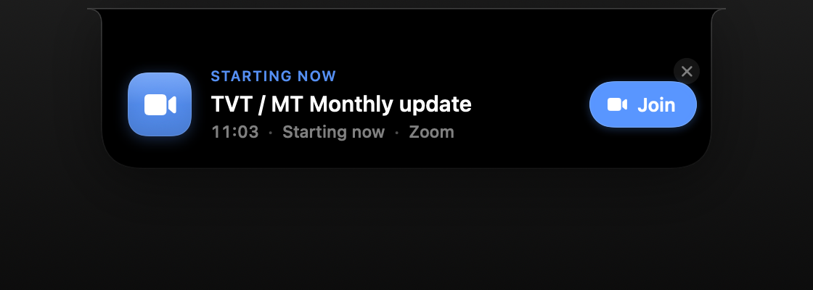

# Adhder

A native macOS menu-bar app that lives in the **notch** and uses **Dynamic Island–style**
morph animations to remind you to join your meetings. When a calendar event is about to
start, a friendly character — **Pip** — bounces out of the notch, waves, and gives you a
one-tap **Join** button so you never miss a meeting again.



## Features

- **Notch-native UI** — a borderless panel pinned to the physical notch (auto-detected via
  `safeAreaInsets` / `auxiliaryTopLeftArea`), with a graceful faux-notch fallback on
  non-notched Macs and external displays.
- **Dynamic Island morph** — three states (collapsed → peek → alert) that spring between
  sizes and corner radii, with concave "ears" flaring out of the notch.
- **Pip the mascot** — a pure-SwiftUI character that breathes, blinks, and waves. No assets.
- **Calendar integration** — EventKit reads your real calendars and surfaces the next
  meeting. Auto-detects Zoom / Google Meet / Teams / Webex / Jitsi (and more) join links.
- **Smart reminders** — the character pops at 5 min, 1 min, and at start time, each once,
  with trackpad haptics. Auto-dismisses if ignored.
- **Menu-bar control** — status item shows the next meeting and offers Join, Test reminder,
  Refresh, and Quit.

## States

| Collapsed | Peek (hover) | Alert (meeting soon) |
|-----------|--------------|----------------------|
| Blends into the notch; pulses a status dot when a meeting is within 10 min | Compact next-meeting HUD with countdown + Join | Pip appears and announces the meeting |

## Architecture

```
Sources/Adhder/
  main.swift              Pure-AppKit bootstrap (accessory app, no Dock icon)
  AppDelegate.swift       Services + NSStatusItem menu + notch panel lifecycle
  Models/MeetingEvent.swift   Value-type snapshot of an EKEvent + join-link detection
  Calendar/CalendarService.swift  EventKit access, polling, publishing upcoming events
  Notch/
    NotchViewModel.swift  State machine + threshold logic for when Pip appears
    NotchGeometry.swift   Resolves physical notch bounds for the active screen
    NotchPanel.swift      Borderless floating NSPanel + frame-syncing controller
    NotchShape.swift      The flat-top, round-bottom notch shape with concave ears
    NotchView.swift       Root morphing view (collapsed / peek)
    AlertView.swift       The character takeover + Join button
    Haptics.swift         Trackpad haptic feedback
  Character/PipCharacter.swift  The animated SwiftUI mascot
  RenderMode.swift        `--render <dir>` offscreen snapshot mode for design review
```

Why pure AppKit instead of a SwiftUI `App`/`MenuBarExtra`: a `MenuBarExtra`-only scene
self-terminated on launch in this environment. A manual `NSApplication` + `NSStatusItem`
bootstrap is the reliable pattern for a notch/agent app, and the notch panel is AppKit
(`NSPanel` + `NSHostingView`) regardless.

## Build & run

```bash
# Build a signed .app bundle (required for the EventKit permission prompt)
./scripts/build_app.sh release

# Launch
open build/Adhder.app
```

## Package for distribution

```bash
./scripts/package.sh
# -> dist/Adhder-<version>.dmg  (drag-to-install, with Applications symlink)
# -> dist/Adhder-<version>.zip
```

The app is ad-hoc signed with a hardened runtime, which is enough to run on your
own Mac and to receive the Calendar (EventKit) permission prompt. To distribute
to other machines without Gatekeeper warnings you'd sign with a Developer ID
certificate and notarize; that's a drop-in change to `scripts/build_app.sh`.

### Install
Open the DMG and drag **Adhder** to **Applications**, then launch it. It lives in
the menu bar (no Dock icon). Grant Calendar access on first launch, and use
**Start at login** from the menu bar to have it launch automatically.

The app runs in the menu bar (no Dock icon). On first launch macOS asks for Calendar
access. Use the menu bar **Test reminder** item to preview Pip without waiting for a meeting.

### Design snapshots

```bash
swift build -c release
"$(swift build -c release --show-bin-path)/Adhder" --render ./docs
```

Writes `alert.png`, `peek.png`, and `character.png` — handy for design review without a
screen-recording grant.

## Requirements

- macOS 14+
- Xcode / Swift 5.9+
